# 00 — Visual Reference (real device screenshots)

These are **real screenshots of the original TomeSonic app** running on the user's phone
(Pixel, 1344×2992, **light theme, Material You ON**). They are the authoritative visual
target. Files live in [`./screenshots/`](./screenshots/). When a source-derived spec (files
01–05) disagrees with these, **the screenshots win** — they show the shipping app.

---

## ⭐ THE #1 FINDING — palette is TEAL Material You, not purple

The original uses **Material 3 dynamic color ("Material You") seeded from the system
wallpaper**, toggled by Settings → *"Use Dynamic Colors (Material You) — Tint the app with
colors from your wallpaper"* (ON by default). On this device the wallpaper yields a
**teal / pine-green** palette. When dynamic color is OFF/unavailable it falls back to the
**brand teal** (`#007988`-family), NOT the Material baseline purple.

Our RN app currently ships the **M3 baseline purple** (`primary rgb(103,80,164)`). **This is
the single biggest reason it "looks like garbage / generic."** Fix = reseed the whole palette
from a teal source color AND wire real dynamic color (`@pchmn/expo-material3-theme` reads the
Android system Material You palette; fall back to a teal tonal palette on iOS/older Android).

Observed light-theme teal palette (sampled from screenshots — approximate, refine from
`material-color-utilities` seeded on the wallpaper/brand teal):
- **primary** (filled play btn, "Add New Server"): deep pine green `~rgb(30,95,80)` / `#1E5F50`
- **on-primary**: white
- **primary-container / secondary-container** (pills, circle buttons, active nav pill,
  "Books" selector, speed pill, mini-player side buttons): pale mint `~rgb(190,225,210)` / `#BEE1D2`
- **on-secondary-container**: dark green-black `~rgb(20,40,33)`
- **surface** (page bg): very light warm grey-green `~rgb(236,240,235)` / `#ECF0EB`
- **surface-container** (cards, sheets): slightly lighter/greyer than surface
- **on-surface**: near-black `~rgb(26,29,27)`
- **on-surface-variant** (subtitles, metadata labels): medium grey `~rgb(95,105,98)`
- **outline / outline-variant**: light grey-green for card borders & dividers
- accent link text (metadata links, "Refresh", "Disconnect" is red-error): primary green
- **tertiary-ish "remaining" chip**: pale sky-blue `~rgb(190,225,240)` with dark text (see below)

Dark theme values: keep the existing dark structure but reseed hues from teal (see 01 spec).

---

## Screenshot gallery (the 19 real references)

| | | |
|---|---|---|
| **01 Home** 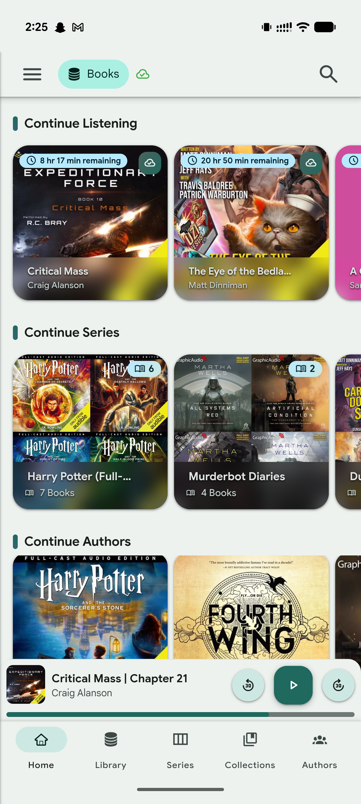 | **02 Player** 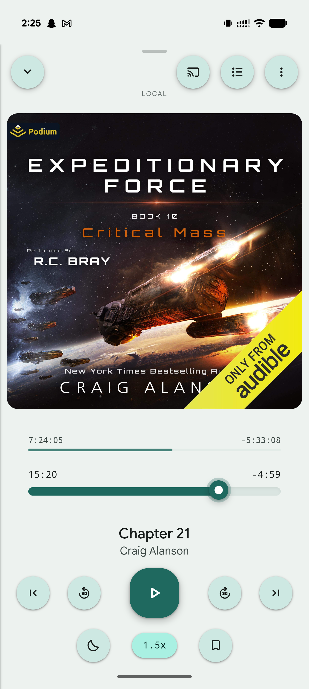 | **03 Cast modal** 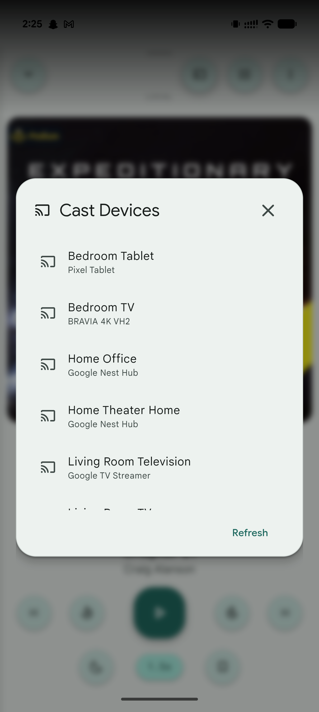 |
| **04 Chapters modal** 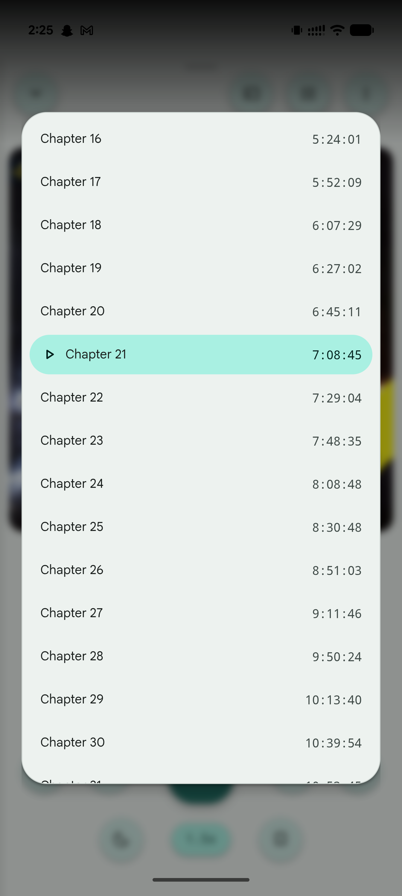 | **05 Library** 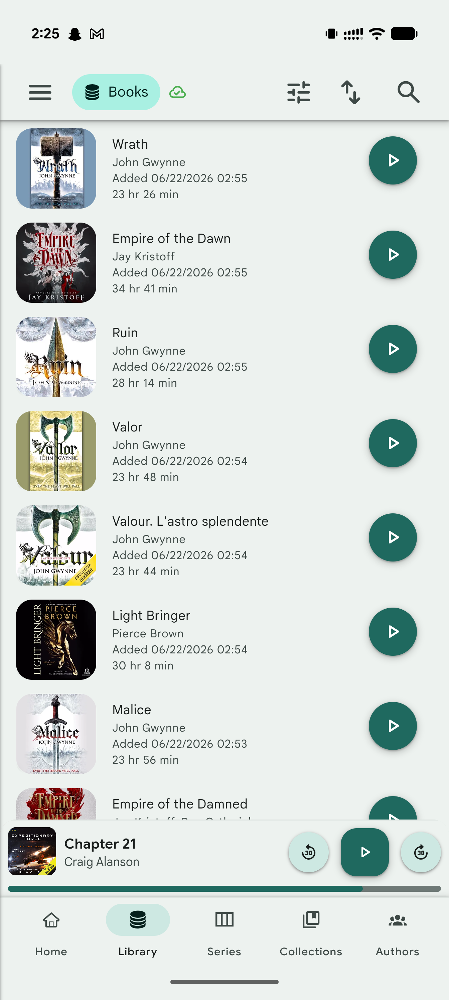 | **06 Filter modal** 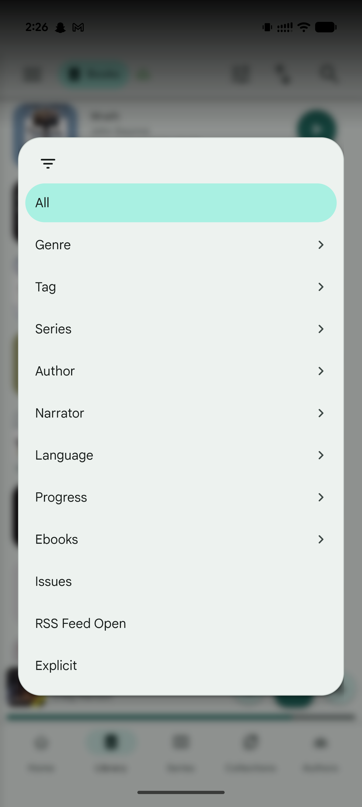 |
| **07 Series grid** 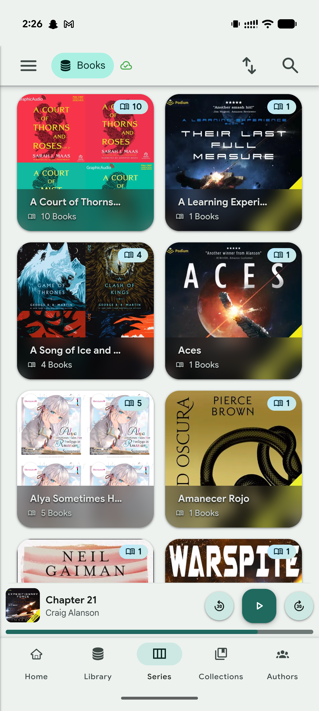 | **08 Collections/Playlists** 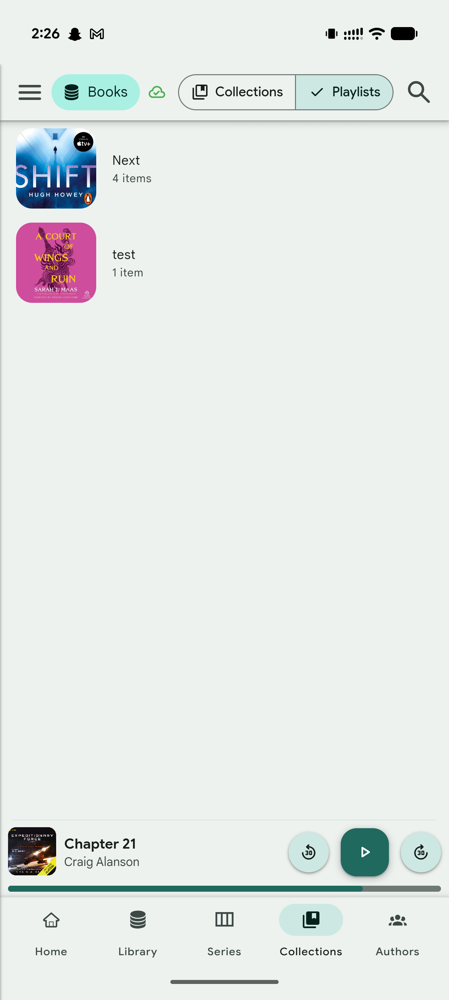 | **09 Authors grid** 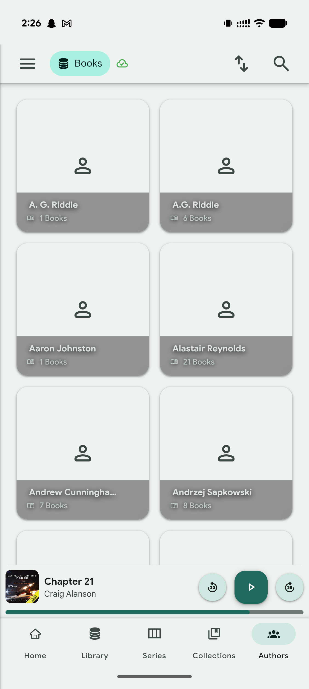 |
| **10 Search (empty)** 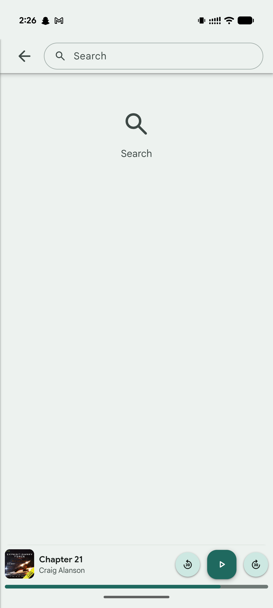 | **11 Side drawer** 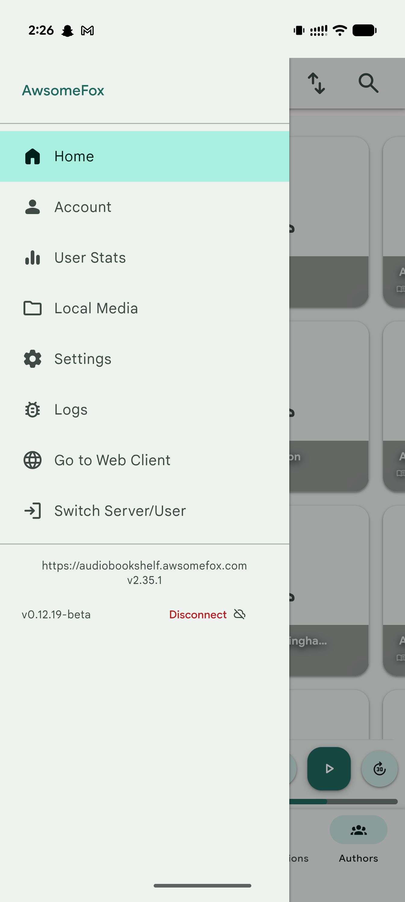 | **12 Account** 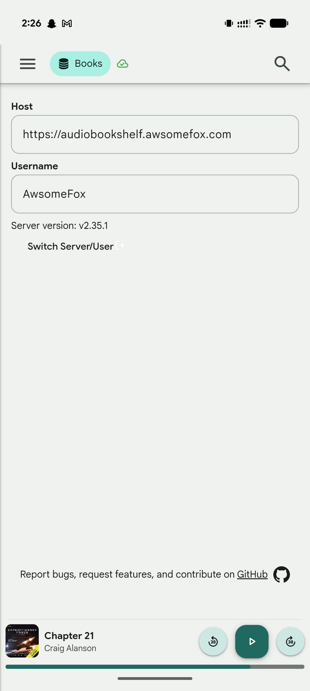 |
| **13 Stats** 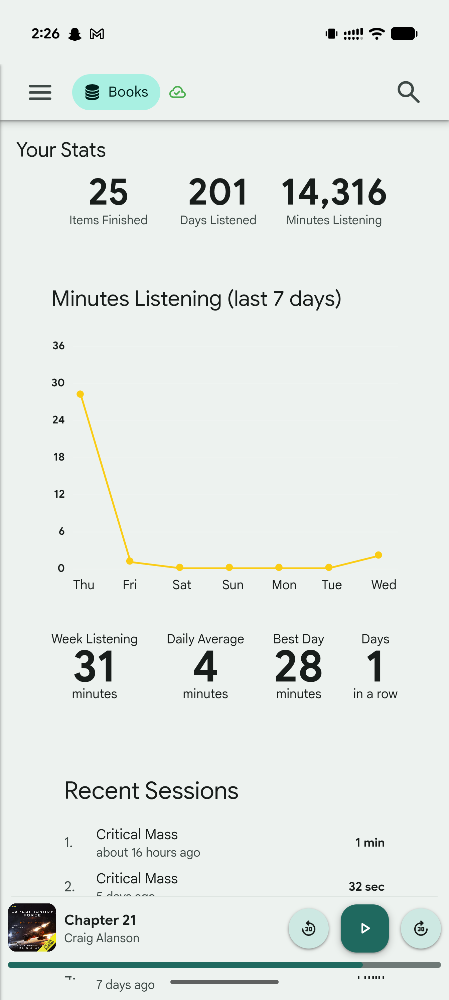 | **14 Local Media** 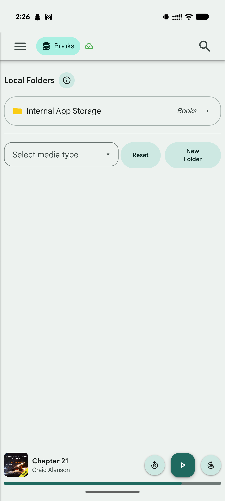 | **15 Settings** 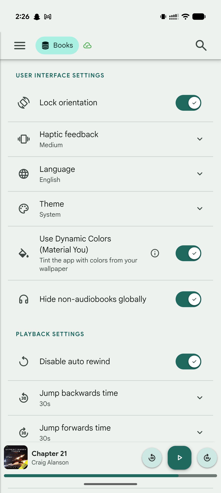 |
| **16 Logs** 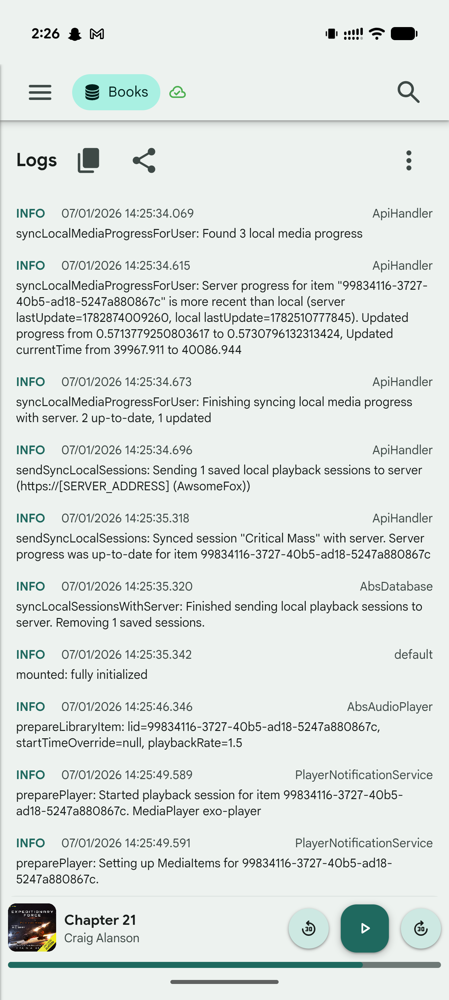 | **17 Switch server** 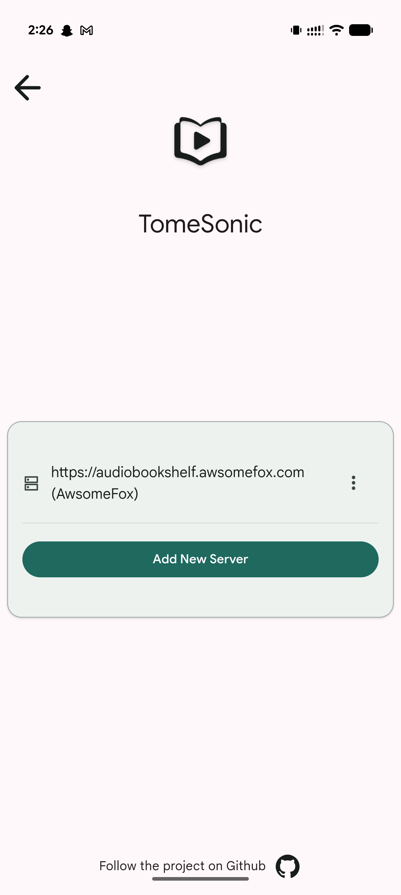 | **18 Item detail** 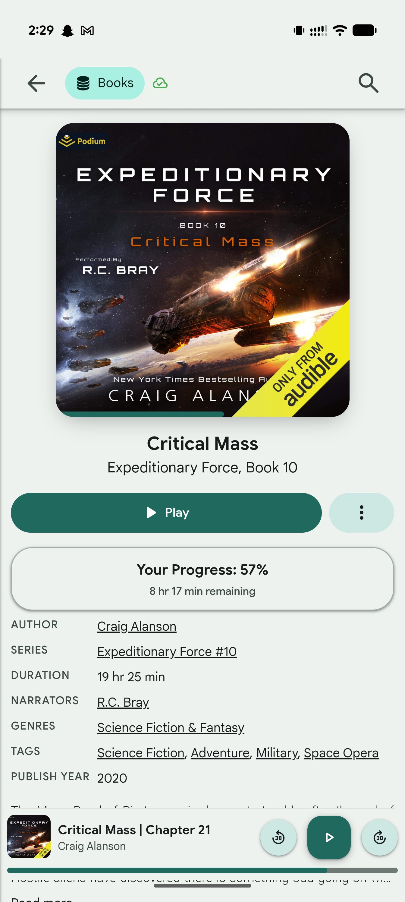 |
| **19 Series detail** 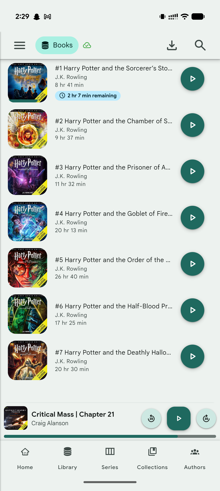 | | |

---

## Global chrome (every main screen)

### Top App Bar  → screenshots 01, 05, 09, 13, 15
Left→right: **hamburger menu** (drawer) · **library selector pill** ("▤ Books" — filled
secondary-container mint pill, DB/stack icon + label) · small **cloud-check** status icon
(green = connected). Right side is **context-dependent**:
- Home/Stats/Settings/Account/Logs: just **search** icon.
- Library: **filter (sliders)** + **sort (up/down arrows)** + **search**.
- Series grid: **sort** + **search**.
- Series *detail*: **download** + **search**.
Bar bg = surface with a hairline bottom divider. Icons are `on-surface`, ~24dp.

### Bottom Navigation Bar  → screenshots 01, 07, 08, 11
5 tabs: **Home** (house) · **Library** (DB/stack) · **Series** (columns) · **Collections**
(stacked books) · **Authors** (people). M3 nav bar: active tab shows a **mint pill behind the
icon** (`secondary-container`, ~64×32, fully rounded) with `on-secondary-container` icon;
label below in ~11–12sp; inactive icons/labels are `on-surface-variant`. Bar bg = surface,
hairline top divider. Sits BELOW the mini-player.

### Mini Player  → screenshots 01, 05, 07, 08, 09, 13, 15, 16 (persists above bottom nav)
Full-width bar, surface bg, hairline top divider. Left→right:
- small rounded **cover thumbnail** (~48–52dp, rounded ~8),
- **title** (bold, `on-surface`, e.g. "Critical Mass | Chapter 21" or just "Chapter 21") +
  **author** (grey) stacked,
- three circular controls: **replay-30** (pale mint circle) · **play/pause** (FILLED pine-green
  **rounded-square** ~56dp, white icon) · **forward-30** (pale mint circle).
- **Thin progress line spanning the full width at the very bottom** (pine-green fill on a
  faint track) — this is the book progress; sits right on top of the nav bar.

### Side Drawer  → [screenshot 11](screenshots/11-side-drawer.png)
Slides from left, ~85% width, surface bg. Top: **username** in primary-green (e.g.
"AwsomeFox"), hairline divider. Items (icon + label, ~large touch rows): **Home** (active =
full-width mint highlight row), **Account**, **User Stats**, **Local Media**, **Settings**,
**Logs**, **Go to Web Client** (globe), **Switch Server/User** (login arrow). Divider, then
centered **server URL + server version** (`https://…  v2.35.1`), and a footer row: app version
(`v0.12.19-beta`, left) + **Disconnect** (red text + disconnect icon, right).

---

## Screen-by-screen targets

### Home (Bookshelf)  → [screenshot 01](screenshots/01-home.png)  · RN: `screens/BookshelfScreen.tsx`
Vertical scroll of **horizontal shelves**. Each shelf header = a **small teal rounded accent
bar** + bold title (~20sp) e.g. "Continue Listening", "Continue Series", "Continue Authors",
"Recently Added". Cards in a horizontally-scrolling row.
- **Book card** (~165dp square): rounded ~20; cover fills; **"time remaining" chip top-left** —
  pale **sky-blue** pill, clock icon + `8 hr 17 min remaining`, tiny; **download cloud button
  top-right** (dark translucent circle); **bottom gradient panel** with title (white bold) +
  author (white 70%). NOTE each card has a subtle **colored glow along the bottom edge derived
  from the cover's dominant color** (yellow for Critical Mass, pink for the 3rd). Nice-to-have.
- **Series card**: **2×2 cover collage**, **book-count badge top-right** (mint pill, book icon
  + count e.g. "6"), dark bottom gradient panel with series name + "7 Books".
- **Author card**: large single/multi cover with author name.

### Library  → [screenshot 05](screenshots/05-library-list.png)  · RN: `screens/LibraryScreen.tsx`
Vertical **list rows** (NOT a grid on this device): left **cover** (~80dp, rounded ~12), then
title (`on-surface`, ~16) · author (grey) · `Added MM/DD/YYYY HH:MM` (grey) · duration
`23 hr 26 min` (grey); right = **filled pine-green circular Play button** (~56dp, white icon)
with elevation. Rows separated by generous spacing (no hard dividers visible). Top bar has
filter + sort + search.

### Series (grid)  → [screenshot 07](screenshots/07-series-grid.png)  · RN: `screens/SeriesListScreen.tsx`
**2-column grid** of large rounded cards (~square). Each = **2×2 collage** (or single cover if
1 book) + **book-count badge top-right** (mint pill w/ book icon) + **bottom gradient panel**
with series name (white bold) + "N Books". Cards have the cover-dominant-color bottom glow.

### Series detail  → [screenshot 19](screenshots/19-series-detail.png)  · RN: `SeriesDetailScreen`
Vertical **list of books in the series**: cover (rounded ~12) + `#1 Harry Potter and the …`
(title truncated, bold) + author (grey) + duration; a **"N hr remaining" sky-blue chip** under
in-progress items; right = pine-green circular Play. Top bar shows **download** + search.

### Collections / Playlists  → [screenshot 08](screenshots/08-collections-playlists.png)  · RN: `screens/CollectionsPlaylistsScreen.tsx`
Below the library pill there's a **segmented toggle**: `▤ Collections` | `✓ Playlists`
(outlined segment group; selected = mint fill w/ check). List rows: cover (rounded) + name
(bold) + "N items" (grey). Empty area otherwise.

### Authors  → [screenshot 09](screenshots/09-authors-grid.png)  · RN: `screens/AuthorsScreen.tsx`
**2-column grid** of author cards: rounded card, surface-container bg, **centered person
icon** placeholder (or author photo), and a **translucent grey bottom panel** with author name
(white bold) + "N Books" (book icon). Top bar: sort + search.

### Search  → [screenshot 10](screenshots/10-search-empty.png)  · RN: `screens/SearchScreen.tsx`
Top bar becomes **back arrow + full-width rounded search field** ("Search", magnifier inside).
Empty state = centered magnifier icon + "Search" label. Results (per source spec) group by
Books/Series/Authors/Narrators/Tags using search cards.

### Item detail  → [screenshot 18](screenshots/18-item-detail.png)  · RN: `screens/ItemDetailScreen.tsx`
Centered **large cover** (rounded ~16, elevation, thin progress bar along its bottom edge).
**Title** (bold ~24, centered) + **series subtitle** ("Expeditionary Force, Book 10", centered
grey). Row: **big pine-green "▶ Play" pill** (flex-grow) + **mint "⋮" more button** (rounded
square). **"Your Progress: NN%" card** (surface-container, rounded ~16) with "8 hr 17 min
remaining" underneath, centered. Then a **metadata table**: left label caps-grey
(AUTHOR/SERIES/DURATION/NARRATORS/GENRES/TAGS/PUBLISH YEAR), right value with **green underlined
links** for author/series/narrator/genre/tags. Then description with **"Read more"**.
(When downloaded/local it shows "Stream / download / more" as in the Play-Store shot — the
green tonal variants.)

### Player (full screen)  → [screenshot 02](screenshots/02-player.png)  · RN: `screens/PlayerScreen.tsx`
Top row: **chevron-down** (pale mint circle, left) · right cluster **cast** · **chapters list**
· **more (⋮)**, all pale-mint circles. Centered tiny **"LOCAL"/"STREAMING" label**.
- **Large cover** (rounded ~20, elevation, full-width w/ margin).
- **TWO stacked progress rows**:
  1. **Book progress** — `7:24:05` left / `-5:33:08` right (mono), **thin** pine-green bar, no thumb.
  2. **Chapter scrubber** — `15:20` left / `-4:59` right (mono), **thicker track with a draggable
     pine-green thumb** (white center dot).
- **Chapter title** (~28, centered) + **author** (grey, centered).
- **Transport row** (5 controls): skip-previous · **jump-back-30** · **FILLED pine-green
  rounded-square PLAY ~96dp** · **jump-forward-30** · skip-next. Side buttons = pale-mint circles.
  (Jump amounts follow settings: here **30s / 30s**, not 10/30.)
- **Secondary row**: **sleep-timer (moon)** pale-mint circle · **speed pill** ("1.5x", mint
  pill, dark-green text) · **bookmark** pale-mint circle.

### Chapters modal  → [screenshot 04](screenshots/04-chapters-modal.png)
Rounded **bottom sheet**, surface bg. Rows: `Chapter N` (left) + `H:MM:SS` timestamp (right,
mono). **Active chapter = full-width mint pill** with a **▶ play-triangle prefix**.

### Cast devices modal  → [screenshot 03](screenshots/03-cast-modal.png)
Rounded sheet. Header: **cast icon + "Cast Devices"** + **✕** (right). Rows: cast icon +
device name (bold) + device type (grey subtitle). Bottom-right **"Refresh"** (green text btn).

### Filter modal  → [screenshot 06](screenshots/06-filter-modal.png)
Rounded sheet with a **filter icon** header. Rows: **"All"** (selected = full-width mint pill) ·
Genre · Tag · Series · Author · Narrator · Language · Progress · Ebooks (each with **›** chevron
= drill-in) · Issues · RSS Feed Open · Explicit (no chevron = direct toggles).

### Stats  → [screenshot 13](screenshots/13-stats.png)  · RN: `screens/StatsScreen.tsx`
"Your Stats" title. **3 big totals** centered: `25 Items Finished` · `201 Days Listened` ·
`14,316 Minutes Listening` (huge bold number, small grey label). **"Minutes Listening (last 7
days)"** heading + **yellow line chart** (Y axis 0–36, X = weekday labels, gold line+dots).
Then 4 mini-stats row: `Week Listening 31 minutes` · `Daily Average 4 minutes` · `Best Day 28
minutes` · `Days 1 in a row`. Then **"Recent Sessions"** numbered list: title + relative time +
right-aligned duration (`1 min`, `32 sec`).

### Settings  → [screenshot 15](screenshots/15-settings.png)  · RN: `screens/SettingsScreen.tsx`
Section headers in **green caps** ("USER INTERFACE SETTINGS", "PLAYBACK SETTINGS"). Rows: leading
icon + title (+ subtitle/value under it) + trailing control. Toggles = **M3 switch, pine-green
when ON with a ✓ in the knob**. Expandable rows show a **chevron-down**. Rows separated by
hairline dividers. Includes: Lock orientation (toggle), Haptic feedback (Medium ⌄), Language
(English ⌄), **Theme (System ⌄)**, **Use Dynamic Colors (Material You)** (toggle + ⓘ, subtitle
"Tint the app with colors from your wallpaper"), Hide non-audiobooks globally (toggle);
Playback: Disable auto rewind (toggle), Jump backwards time (30s ⌄), Jump forwards time (30s ⌄).

### Account  → [screenshot 12](screenshots/12-account.png)  · RN: account screen
"Host" label + read-only field (server URL) · "Username" label + field · "Server version:
v2.35.1" · "Switch Server/User" link (login-arrow) · footer "Report bugs… on GitHub" + GitHub icon.

### Local Media  → [screenshot 14](screenshots/14-local-media.png)
"Local Folders" bold + ⓘ circle. Row card: **yellow folder icon** + "Internal App Storage" +
italic "Books" + **›**. Divider. Then "Select media type" **dropdown** + **Reset** + **New
Folder** (mint tonal pill buttons).

### Logs  → [screenshot 16](screenshots/16-logs.png)  · RN: `screens/LogsScreen.tsx`
"Logs" title + **copy** + **share** icons + **⋮**. Entries: **INFO** (green bold) + timestamp +
right-aligned **source tag** ("ApiHandler"), then the message wrapping below in `on-surface`.

### Switch Server / Connect  → screenshots 17, and Play-Store login shot
Centered **TomeSonic book-play logo** (mono, ~outline style) + "TomeSonic" wordmark. A
surface-container **card**: saved-server row (server icon + `https://… (User)` + ⋮) · divider ·
**"Add New Server"** big pine-green pill. Footer "Follow the project on Github" + icon.
The *login* form (Play-Store shot): logo + "Server address" field (`http://…`) + green "Submit".

---

## RN port status (fill in as we go)
| Screen | RN file | Status | Notes |
|---|---|---|---|
| Palette / dynamic color | `theme/palette.ts`, `useThemeColors.ts` | ❌ | **PURPLE → TEAL Material You. Highest priority.** |
| Top app bar | `components/TopAppBar.tsx` | 🟡 | needs library pill + cloud + context actions |
| Bottom nav | `navigation/AppNavigator.tsx` | 🟡 | check active mint pill sizing |
| Mini player | mini-player component | 🟡 | rounded-square play, 30/30, full-width bottom progress |
| Side drawer | — | ❌ | not built |
| Home | `screens/BookshelfScreen.tsx` | ✅ | teal accent bar + 20sp title; sky-blue "N hr N min remaining" chip; dark translucent cloud btn; mint book-count badge; 2×2 series collage w/ gradient panel; covers from shelf `books`. Bottom cover-glow still nice-to-have. |
| Library | `screens/LibraryScreen.tsx` | ✅ | list rows w/ 80dp cover, added/duration, 56dp pine-green Play (centered), generous spacing, no dividers — matches shot 05 |
| Series grid | `screens/SeriesListScreen.tsx` | ✅ | 2-col rounded cards; 2×2 collage from series `books` (lazy `/items?filter=series.<enc>` fallback when payload omits books, so covers actually load); mint secondary-container book-count badge; dark gradient panel w/ name + "N Books" — matches shot 07 |
| Series detail | `SeriesDetailScreen` | ✅ | list rows: rounded cover + "#N Title" bold + author + duration; sky-blue tertiary-container "N hr remaining" chip on in-progress; 56dp pine-green Play (startPlayback); top bar download + search — matches shot 19 |
| Collections/Playlists | `screens/CollectionsPlaylistsScreen.tsx` | ✅ | outlined segmented toggle (▤ Collections / ✓ Playlists, selected = mint fill + check) under app bar; vertical list rows (72dp rounded collage cover + bold name + grey "N items"); tap → detail — matches shot 08 |
| Collection detail | `screens/CollectionDetailScreen.tsx` | ✅ | header (collage cover + title + count·duration + Play all pill) then series-style item rows (cover + title + author + duration + pine-green circular play) |
| Playlist detail | `screens/PlaylistDetailScreen.tsx` | ✅ | header (collage cover + title + count·duration + Play all pill) then item rows (cover + title + author + duration + pine-green circular play) |
| Authors | `screens/AuthorsScreen.tsx` | ✅ | 2-col square rounded cards (surface-container bg + outline-variant border); full-bleed author photo OR 2×2 cover collage OR centered person icon; translucent grey bottom panel (white bold name + book-icon "N Books"); top bar sort+search; sort pills — matches shot 09 |
| Author detail | `screens/AuthorDetailScreen.tsx` | ✅ | back-arrow header w/ hairline divider; primary-circle person avatar (or photo) + name + book count + description; book list rows (cover + title + subtitle) → ItemDetail |
| Search | `screens/SearchScreen.tsx` | ✅ | back arrow + full-width rounded outlined search field (magnifier inside, "Search" placeholder); empty state = centered magnifier + "Search"; debounced `/search?q=`; grouped Books/Series/Authors/Narrators/Tags row cards (cover/collage + title + subtitle) — matches shot 10 |
| Item detail | `screens/ItemDetailScreen.tsx` | ✅ | centered cover w/ progress edge + series subtitle, Play pill + mint more btn, Your Progress card, 2-col metadata table w/ green underlined links, Read more — matches shot 18 |
| Player | `screens/PlayerScreen.tsx` | 🟡 | two progress bars, 30/30, teal |
| Chapters modal | in PlayerScreen | 🟡 | active mint pill + play prefix |
| Cast modal | ❌ | ❌ | needs react-native-google-cast |
| Filter modal | `components/FilterModal.tsx` | ✅ | rounded bottom sheet w/ filter-icon header + Clear Filter; All (mint secondary-container pill when selected) + Genre/Tag/Series/Author/Narrator/Language/Progress/Ebooks (chevron drill-in) + Issues/RSS Feed Open/Explicit; sublists from lazily-loaded filterData ($encode'd values, series adds "No Series"); Back row; wired into LibraryScreen (re-fetches `/items?filter=`) — matches shot 06 |
| Order/Sort modal | `components/OrderModal.tsx` | ✅ | rounded bottom sheet w/ swap-vert header; book/podcast/series field lists; selected row = mint pill + north/south chevron (asc/desc toggle on re-tap); addedAt defaults desc; wired into LibraryScreen (sort+desc) and SeriesListScreen (series sort) |
| Stats | `screens/StatsScreen.tsx` | ✅ | 3 big totals, "Minutes Listening (last 7 days)" heading + View-based gold line chart (Y axis + gridlines + dots + weekday labels; react-native-svg not installed), 4-up mini-stats (Week/Daily Avg/Best Day/Days in a row), numbered Recent Sessions — matches shot 13 |
| Settings | `screens/SettingsScreen.tsx` | ✅ | green-caps section heads (USER INTERFACE / PLAYBACK SETTINGS), icon+title(+subtitle) rows, hairline dividers, custom M3 switch (pine-green + ✓ knob when ON), Theme cycler wired to useThemeStore, Use Dynamic Colors toggle+ⓘ+subtitle wired to useThemeStore.useDynamicColors (persisted; DynamicThemeContext falls back to static teal when OFF) — matches shot 15 |
| Account | `screens/AccountScreen.tsx` | ✅ | back-arrow header; read-only "Host" + "Username" labeled outlined fields (label ABOVE, from useUserStore user/serverConnectionConfig); "Server version: vX"; right-aligned "Switch Server/User" primary link + logout icon (calls logout → nav swaps to Connect); GitHub footer "Report bugs… on GitHub" + globe icon — matches shot 12 |
| Local Media | `screens/LocalMediaScreen.tsx` | ✅ | back-arrow header; "Local Folders" bold + mint info circle (dialog + guide link); "Internal App Storage" folder row card (yellow folder icon + media-type italic + chevron); divider; functional "Select media type" dropdown (modal, book/podcast) + Reset + New Folder mint tonal pills (media-type gating + feedback; no native folder store yet) — matches shot 14 |
| Logs | `screens/LogsScreen.tsx` | ✅ | "Logs" title row + copy/share Icon btns + ⋮ overflow (mask-server-address toggle + clear logs); entries = LEVEL (INFO=primary/WARN=tertiary/ERROR=error, bold caps) + `MM/DD/YYYY HH:mm:ss.SSS` + right-aligned source tag, message wraps below in on-surface; zebra rows (surfaceContainerLowest); copy/share mask server URLs; auto-scroll to bottom; existing appLogger data source — matches shot 16 |
| Downloads | `screens/DownloadsScreen.tsx` | ✅ | back-arrow header; Downloaded/Downloading tab bar (primary underline); rows = 56dp rounded cover (book Icon fallback) + title + author; completed rows have pine-green circular Play + trash remove; active rows have status label + progress bar (surfaceContainerHighest track, primary fill) + % + close; secondary-container circle Icon empty states; keeps useDownloadStore wiring — emoji removed |
| Latest episodes | `screens/LatestEpisodesScreen.tsx` | ✅ | back-arrow header + teal accent section head; podcast latest-episode rows = 60dp cover (podcast Icon fallback) + underlined primary podcast title + episode title + date · duration + mint Play circle + download Icon; recent-episodes API wiring intact — emoji removed |
| Switch server / Connect | `screens/ConnectScreen.tsx` | ✅ | polished login form: centered logo + "TomeSonic" wordmark; surface-container card with "Server address" label ABOVE the field (no longer overlapping the card border), pine-green full-width rounded Submit, red disclaimer below; local + OpenID login logic intact (oauth.ts) — matches Play-Store login shot |
</content>
