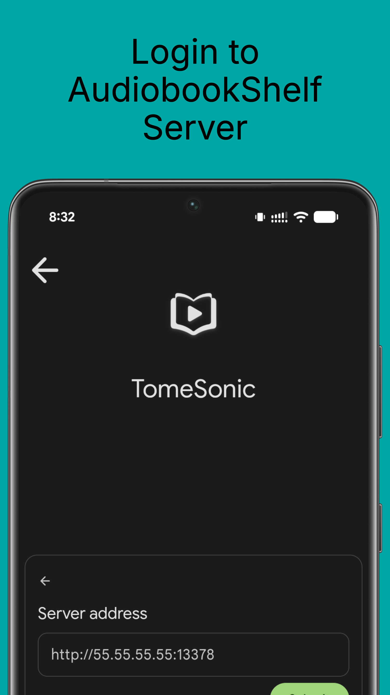
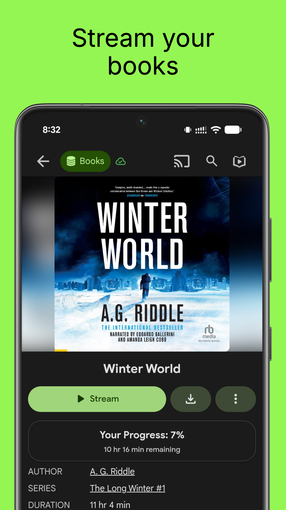
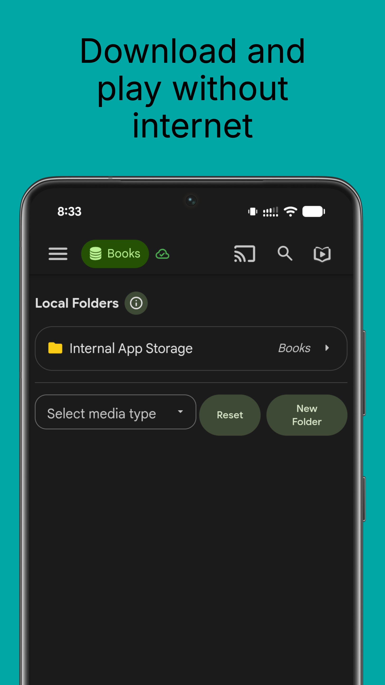
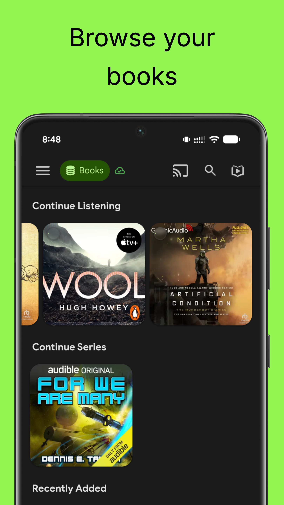

# TomeSonic Mobile App

TomeSonic is a premium mobile companion for your AudiobookShelf server, bringing your personal audiobook library to Android and iOS with stunning Material You theming and advanced features.

## ✨ Key Features

### 🎧 AudiobookShelf Integration
- Seamless connection to your self-hosted AudiobookShelf server
- Access your entire audiobook library from anywhere
- Secure, direct connection to your personal media server

### 📱 Stream & Download
- Stream audiobooks directly from your server for instant access
- Download books locally for offline listening during commutes or travel
- Smart download management with storage optimization
- High-quality audio streaming with adaptive bitrate

### 🎨 Beautiful Material You Design
Experience a gorgeous interface that adapts to your device's color scheme. TomeSonic embraces Material You design language, automatically matching your phone's wallpaper colors for a cohesive, personalized look.

### 📚 Comprehensive Library Management
- Browse your collection by author, series, or genre
- Advanced search and filtering capabilities
- Bookmark your favorite moments with chapter navigation
- Playlist creation and management
- Precise seeking and chapter-based navigation

### 📊 Detailed Statistics
Track your audiobook journey with comprehensive listening analytics:
- Daily and weekly listening time tracking
- Books completed and progress monitoring
- Listening streaks and achievements
- Reading goals and milestone tracking

### 🚗 Android Auto Ready
Enjoy hands-free audiobook listening in your car:
- Full Android Auto integration with voice commands
- Car-optimized interface for safe browsing
- Seamless transition between phone and car
- Perfect for commutes and road trips

### 📺 ChromeCast Support
Cast your audiobooks to any ChromeCast-enabled device:
- Stream to smart speakers and displays
- Control playback from your phone
- High-quality audio casting
- Perfect for shared listening experiences

### 🔄 Perfect Sync
Your progress stays synchronized across all devices:
- Real-time progress sync with your AudiobookShelf server
- Resume exactly where you left off on any device
- Bookmark and settings synchronization
- Cross-platform continuity

### ⚙️ Advanced Playback Features
- Sleep timer with customizable fade-out
- Variable playback speeds (0.5x to 3.0x)
- Background playback with notification controls
- Cellular data usage controls
- Customizable interface themes

## 📱 Download

### Android (beta)
Get the Android app on the [Google Play Store](https://play.google.com/store/apps/details?id=com.tomesonic.app)

### iOS (early beta)
**Beta is currently full. Apple has a hard limit of 10k beta testers. Updates will be posted in Discord.**

Using Test Flight: https://testflight.apple.com/join/wiic7QIW **_(beta is full)_**

## 📸 Screenshots

### 🏠 Home & Library


*Beautiful Material You theming that adapts to your device colors*

### 🎵 Now Playing


*Full-featured audio player with chapter navigation and playback controls*

### 📚 Library Management


*Comprehensive library browsing with search and filtering*

### 📊 Listening Statistics


*Detailed analytics to track your audiobook journey*

### 📱 Multiple Device Support
Screenshots available for:
- **Phone**: Samsung Galaxy S21 Ultra optimized interface
- **Tablet**: Samsung Galaxy Tab S7 and HTC Nexus 9 layouts
- **All devices**: Responsive design adapts to any screen size

*Full screenshot galleries are available in the `screenshots/` directory organized by device type.*

---

## About TomeSonic

TomeSonic is a mobile-focused fork of the excellent [AudiobookShelf](https://www.audiobookshelf.org) project created by [advplyr](https://github.com/advplyr). We're deeply grateful for the solid foundation and open-source community that AudiobookShelf provides.

### 🙏 Credits & Attribution

- **Original Project**: [AudiobookShelf](https://github.com/advplyr/audiobookshelf) by [advplyr](https://github.com/advplyr)
- **Mobile Foundation**: Built upon the original AudiobookShelf mobile app
- **Community**: Thanks to the AudiobookShelf community for localization, testing, and feedback
- **Infrastructure**: [Weblate](https://hosted.weblate.org/engage/audiobookshelf/) for translation hosting

TomeSonic enhances the mobile experience with premium features and modern design while maintaining full compatibility with AudiobookShelf servers. For the complete AudiobookShelf ecosystem including server software, visit [audiobookshelf.org](https://audiobookshelf.org).

**Requires an AudiobookShelf server to connect with**

TomeSonic respects your privacy by connecting directly to YOUR AudiobookShelf server. No third-party tracking, no data collection - just you and your audiobooks.

## 🚀 Recent Updates & Enhancements

### Latest Features (v0.12.1-beta)
- **🎨 Material You Dynamic Theming**: App colors automatically adapt to your wallpaper
- **📺 Enhanced ChromeCast Support**: Improved casting reliability and device discovery
- **🔄 Smart Progress Sync**: Seamless transitions between local and streaming playbook
- **📱 Offline Mode**: Full offline support with automatic downloaded book detection
- **🚗 Android Auto Integration**: Complete hands-free audiobook experience in your car
- **📊 Advanced Statistics**: Comprehensive listening analytics and progress tracking
- **⚡ Performance Improvements**: Faster loading, smoother navigation, optimized battery usage

### Privacy & Open Source
TomeSonic maintains the open-source spirit of AudiobookShelf while focusing on mobile excellence. All enhancements respect user privacy and maintain compatibility with standard AudiobookShelf servers.

## 🚀 Quick Setup

### For Users
1. **Install AudiobookShelf Server**: Set up your AudiobookShelf server (v2.0+) following the [official guide](https://www.audiobookshelf.org/install)
2. **Download TomeSonic**: Get the app from Google Play Store or TestFlight
3. **Connect**: Enter your server URL and credentials
4. **Enjoy**: Start streaming and downloading your audiobooks!

### Server Requirements
- AudiobookShelf server version 2.0 or higher
- Network access to your server (local network or internet)
- HTTPS recommended for external access

---

## 🛠️ Development

This application is built using [NuxtJS](https://nuxtjs.org/) and [Capacitor](https://capacitorjs.com/) to run on both iOS and Android with a shared codebase.

### Build System

TomeSonic uses [Just](https://github.com/casey/just) for build automation. Key commands:

```bash
# Development workflow
just build-nuxt          # Build Nuxt.js and sync Capacitor
just run-debug          # Build, install, and run debug APK
just run                # Full workflow with Android Auto

# Version management  
just version            # Show current version
just bump-beta          # Bump to next beta (0.12.1-beta → 0.12.2-beta)
just bump-version "1.0.0"  # Set specific version
just sync-version       # Sync package.json version to Android

# Android development
just build              # Build Android APK
just install-debug      # Install debug APK to device
just android-logcat     # View Android logs
```

All commands automatically sync versions between `package.json` and Android `build.gradle`.

### 🌍 Localization

TomeSonic utilizes the original AudiobookShelf localization infrastructure. Thanks to [Weblate](https://hosted.weblate.org/engage/audiobookshelf/) for hosting the localization infrastructure pro-bono. To see TomeSonic in your language, please help localize the original project at [audiobookshelf.org](https://www.audiobookshelf.org/faq#how-do-i-help-with-translations).

### 🤝 Contributing

Contributions are welcome! TomeSonic maintains compatibility with AudiobookShelf while focusing on mobile enhancements:

- **Bug Reports**: Submit issues via GitHub Issues
- **Feature Requests**: Discuss new ideas in GitHub Discussions  
- **Code Contributions**: Follow standard pull request workflow
- **Localization**: Contribute translations via the AudiobookShelf Weblate project

Please ensure any mobile-specific features maintain server compatibility and follow Material Design guidelines.

---

## 📋 Environment Setup

### Prerequisites
- **AudiobookShelf Server** (v2.0+) - [Installation Guide](https://www.audiobookshelf.org/install)
- **Node.js** (version 20) - [Download](https://nodejs.org/)
- **Android Studio** - [Download](https://developer.android.com/studio) (for Android development)
- **Xcode** - [Mac App Store](https://apps.apple.com/app/xcode/id497799835) (for iOS development)

---

### Windows Environment Setup for Android

Required Software:

- [Git](https://git-scm.com/downloads)
- [Node.js](https://nodejs.org/en/) (version 20)
- Code editor of choice([VSCode](https://code.visualstudio.com/download), etc)
- [Android Studio](https://developer.android.com/studio)
- [Android SDK](https://developer.android.com/studio)

<details>
<summary>Install the required software with <a href=(https://docs.microsoft.com/en-us/windows/package-manager/winget/#production-recommended)>winget</a></summary>

<p>
Note: This requires a PowerShell prompt with winget installed.  You should be able to copy and paste the code block to install.  If you use an elevated PowerShell prompt, UAC will not pop up during the installs.

```PowerShell
winget install -e --id Git.Git; `
winget install -e --id Microsoft.VisualStudioCode; `
winget install -e --id  Google.AndroidStudio; `
winget install -e --id OpenJS.NodeJS --version 20.11.0;
```


</p>
</details>
<br>

Your Windows environment should now be set up and ready to proceed!

### GitHub Codespaces Environment Setup

GitHub Codespaces provides a pre-configured development environment with all necessary tools already installed, making it the fastest way to start developing TomeSonic.

**✅ Pre-configured in Codespaces:**
- Node.js (version 20)
- Android SDK and tools  
- Git and development utilities
- All required dependencies

**🚀 Quick Start:**

1. **Open in Codespaces**: Click the "Code" button on GitHub and select "Open with Codespaces"
2. **Wait for setup**: The container will automatically configure (~2-3 minutes)
3. **You're ready!** Skip directly to the development workflow below

**📱 Note for Mobile Testing:**
While Codespaces excels for development, you'll need a physical device or local emulator for testing. Use the build commands to generate APKs that can be downloaded and tested on your device.

### Mac Environment Setup for Android

Required Software:

- [Android Studio](https://developer.android.com/studio)
- [Node.js](https://nodejs.org/en/) (version 20)
- [Cocoapods](https://guides.cocoapods.org/using/getting-started.html#installation)
- [Android SDK](https://developer.android.com/studio)

<details>
<summary>Install the required software with <a href=(https://brew.sh/)>homebrew</a></summary>

<p>

```zsh
brew install android-studio node cocoapods
```

</p>
</details>

### Start working on the Android app

#### For GitHub Codespaces Users

If you're using GitHub Codespaces, the environment is already set up! Simply run:

```shell
# Install Just (build automation tool)
curl --proto '=https' --tlsv1.2 -sSf https://just.systems/install.sh | bash -s -- --to ~/.local/bin
echo 'export PATH="$HOME/.local/bin:$PATH"' >> ~/.bashrc
source ~/.bashrc

# Install dependencies (if not already installed)
npm install

# Generate static web app
npm run generate

# Sync with Android project
npx cap sync android

# Build for Android (generates APK for download/testing)
# Note: If 'just build' fails with "Illegal option -o pipefail", use this alternative:
cd android && ./gradlew assembleDebug
```

**📱 Testing on Device:**
Since Codespaces runs in the cloud, you can't directly install to a device. Use these approaches:
- **Download APK**: After building, download the generated APK from the workspace
- **GitHub Releases**: Latest APKs are available in [GitHub Releases](https://github.com/AwsomeFox/tomesonic-app/releases)
- **Local Development**: For device testing, consider cloning to a local environment
- **GitHub Actions**: Automated builds are available in the Actions tab

---

## 🚀 Release Process

TomeSonic uses an automated release pipeline that handles building, signing, and distributing updates across multiple channels.

### 📋 Release Workflow

1. **🔄 Version Management**: 
   ```bash
   # Bump version (updates package.json and Android gradle)
   just bump-version "1.0.0"        # Specific version
   just bump-beta                    # Next beta (0.12.1-beta → 0.12.2-beta)
   just release                      # Remove beta suffix
   ```

2. **🏷️ Create Release**: 
   ```bash
   git add -A
   git commit -m "Release v1.0.0"
   git tag v1.0.0
   git push origin master --tags
   ```

3. **🤖 Automated Deployment**:
   - **GitHub Release**: APK automatically built and attached to release
   - **Play Store**: Signed AAB deployed to internal track (then promoted)
   - **GitHub Pages**: Test APK available for beta testers

### 📱 Distribution Channels

- **🏪 Play Store**: Production releases via Google Play Console
- **🧪 GitHub Releases**: Beta/test APKs for direct download
- **🌐 GitHub Pages**: Latest development builds at [your-github-pages-url]
- **📋 Actions Artifacts**: Development builds from pull requests

### 🔐 Signing & Security

- **Debug builds**: Self-signed for development/testing
- **Release builds**: Properly signed with upload keystore for Play Store
- **Secrets**: Keystore and credentials managed via GitHub Secrets

#### For Local Development

Clone or fork the project from terminal or powershell and `cd` into the project directory.

Install the required node packages:

```shell
npm install
```

<details>
<summary>Expand for screenshot</summary>


</details>
<br>

Generate static web app:

```shell
npm run generate
```

<details>
<summary>Expand for screenshot</summary>


</details>
<br>

Copy web app into native android/ios folders:

```shell
npx cap sync
```

<details>
<summary>Expand for screenshot</summary>


</details>
<br>

Open Android Studio:

```shell
npx cap open android
```

<details>
<summary>Expand for screenshot</summary>


</details>
<br>

Start coding!

### Mac Environment Setup for iOS

Required Software:

- [Xcode](https://developer.apple.com/xcode/)
- [Node.js](https://nodejs.org/en/)
- [Cocoapods](https://guides.cocoapods.org/using/getting-started.html#installation)

### Start working on the iOS app

Clone or fork the project in the terminal and `cd` into the project directory.

Install the required node packages:

```shell
npm install
```

<details>
<summary>Expand for screenshot</summary>


</details>
<br>

Generate static web app:

```shell
npm run generate
```

<details>
<summary>Expand for screenshot</summary>


</details>
<br>

Copy web app into native android/ios folders:

```shell
npx cap sync
```

<details>
<summary>Expand for screenshot</summary>


</details>
<br>

Open Xcode:

```shell
npx cap open ios
```

<details>
<summary>Expand for screenshot</summary>


</details>
<br>

Start coding!
