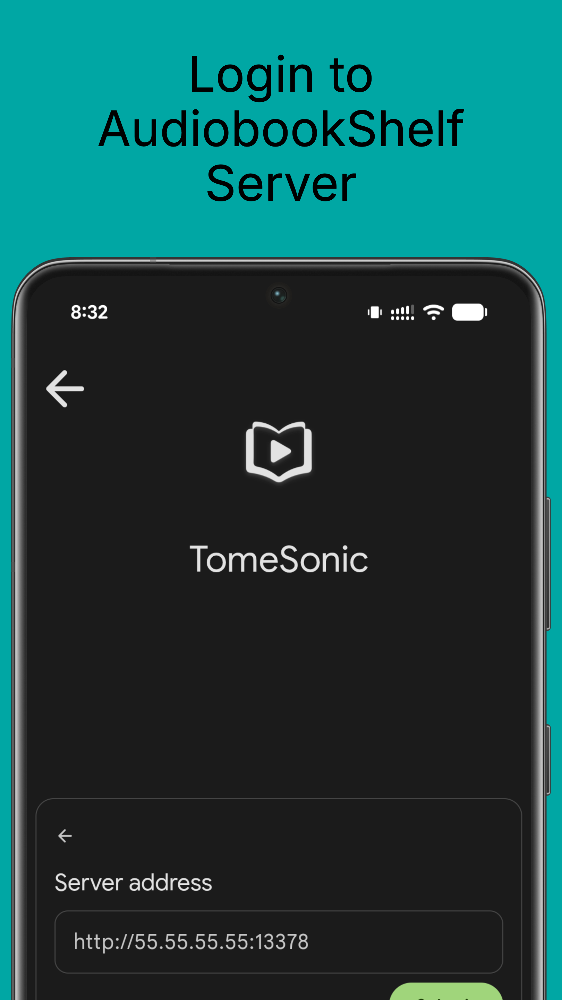
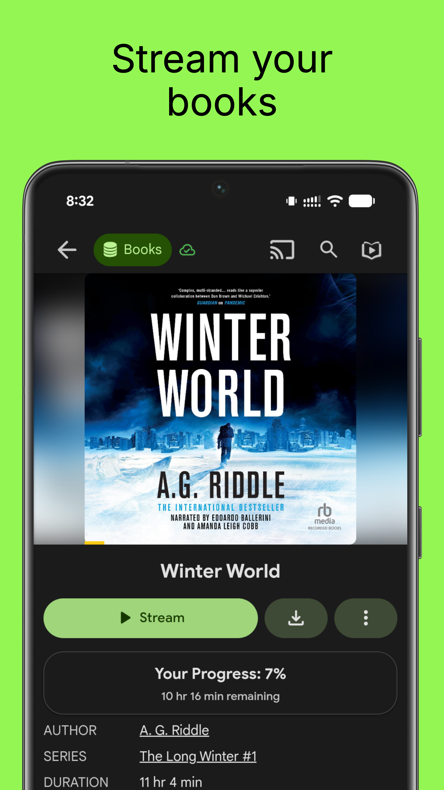
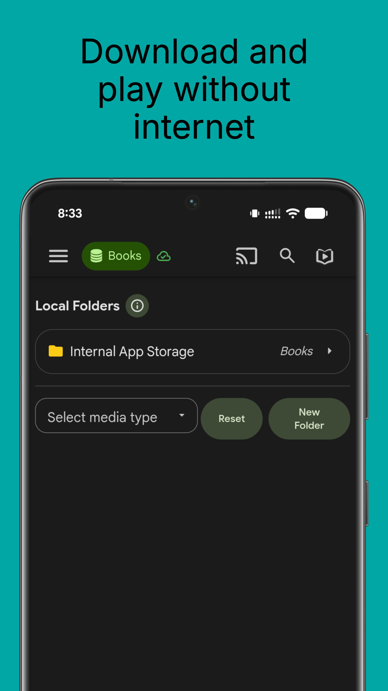
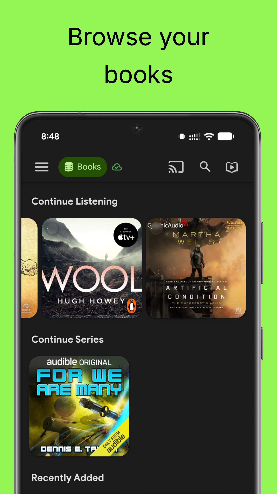

[](https://github.com/AwsomeFox/tomesonic-app/actions/workflows/deploy-playstore.yml)
# TomeSonic Mobile App

TomeSonic is a premium mobile companion for your AudiobookShelf server, bringing your personal audiobook library to Android with stunning Material You theming and advanced features. The app is a native React Native (Expo) application living in [`native/`](native).

## ✨ Key Features

### 🎧 AudiobookShelf Integration
- Seamless connection to your self-hosted AudiobookShelf server
- Access your entire audiobook library from anywhere
- Secure, direct connection to your personal media server

### 📱 Stream & Download
- Stream audiobooks directly from your server for instant access
- Download books locally for offline listening during commutes or travel
- Smart download management with storage optimization

### 🎨 Beautiful Material You Design
Experience a gorgeous interface that adapts to your device's color scheme. TomeSonic embraces Material You design language, automatically matching your phone's wallpaper colors for a cohesive, personalized look.

### 📚 Comprehensive Library Management
- Browse your collection by author, series, or genre
- Advanced search and filtering capabilities
- Bookmark your favorite moments with chapter navigation
- Playlist and collection management
- Precise seeking and chapter-based navigation

### 📊 Detailed Statistics
Track your audiobook journey with comprehensive listening analytics:
- Daily and weekly listening time tracking
- Books completed and progress monitoring
- Listening streaks and achievements

### 🚗 Android Auto Ready
Enjoy hands-free audiobook listening in your car:
- Full Android Auto integration — browse and play without touching your phone
- Starts with the car, even when the app isn't running
- Car-optimized interface with chapter navigation and resume

### 📺 ChromeCast Support
Cast your audiobooks to any ChromeCast-enabled device:
- Seamless handoff — playback picks up exactly where you were
- Single notification with chapter-aware titles, speed and chapter controls
- Control playback from your phone

### 🔄 Perfect Sync
Your progress stays synchronized across all devices:
- Real-time progress sync with your AudiobookShelf server
- Offline-safe: listening/reading progress queues and syncs when you reconnect
- Resume exactly where you left off on any device
- Ebook reading progress synced alongside audio

### ⚙️ Advanced Playback Features
- Sleep timer (fixed or end-of-chapter) with fade-out
- Variable playback speeds
- Background playback with notification controls
- Ebook reader for EPUB/PDF with progress sync

## 📱 Download

### Android
Get the app on the [Google Play Store](https://play.google.com/store/apps/details?id=com.tomesonic.app), or grab the APK from the latest [GitHub Release](https://github.com/AwsomeFox/tomesonic-app/releases).

## 📸 Screenshots

   

*Full galleries (phone + tablet) live in the `screenshots/` directory.*

---

## About TomeSonic

TomeSonic is a mobile-focused fork of the excellent [AudiobookShelf](https://www.audiobookshelf.org) project created by [advplyr](https://github.com/advplyr). We're deeply grateful for the solid foundation and open-source community that AudiobookShelf provides.

### 🙏 Credits & Attribution

- **Original Project**: [AudiobookShelf](https://github.com/advplyr/audiobookshelf) by [advplyr](https://github.com/advplyr)
- **Mobile Foundation**: Inspired by the original AudiobookShelf mobile app
- **Community**: Thanks to the AudiobookShelf community for testing and feedback

TomeSonic respects your privacy by connecting directly to YOUR AudiobookShelf server. No third-party tracking, no data collection — just you and your audiobooks. **Requires an AudiobookShelf server (v2.0+) to connect with.**

## 🚀 Quick Setup

1. **Install AudiobookShelf Server**: follow the [official guide](https://www.audiobookshelf.org/install)
2. **Download TomeSonic** from the Play Store or GitHub Releases
3. **Connect**: enter your server URL and credentials (username/password or OpenID)
4. **Enjoy**: start streaming and downloading your audiobooks

---

## 🛠️ Development

TomeSonic is a **React Native app built with Expo** (SDK 57, React Native 0.86, New Architecture + Hermes). Everything lives under [`native/`](native):

| | |
|---|---|
| Player | [react-native-track-player](https://rntp.dev) 5 (Media3) with a patched Android Auto browse service |
| State | zustand stores (`native/store/`) |
| Storage | MMKV (settings/caches) + Keystore-encrypted secure store (tokens) |
| Casting | react-native-google-cast with a custom single-notification options provider |
| Reader | foliate-js in a WebView (EPUB), react-native-pdf (PDF) |

### Getting started

```bash
cd native
npm install                 # postinstall applies patch-package patches
npx expo run:android        # dev build on a connected device/emulator
```

Release build (what CI and the Play Store use):

```bash
cd native/android
SENTRY_DISABLE_AUTO_UPLOAD=true ./gradlew app:assembleRelease -x lint -x test
```

Notes:
- Native config is generated by Expo config plugins in `native/plugins/` — after `npx expo prebuild`, force-add any newly generated `android/` files the manifest references (the gitignore blocks new files there).
- `native/patches/` holds the react-native-track-player Media3/Android Auto patch. Regenerate with `npx patch-package react-native-track-player --exclude 'android/build'`.
- Root `package.json` only proxies scripts (`npm run android`, `npm run sync-version`); the app's dependencies live in `native/package.json`.
- The `justfile` has Android Auto desktop-head-unit helpers (`just run-aa`).

### Testing

See [native/TESTING.md](native/TESTING.md) for conventions.

```bash
cd native
npm test                    # jest: 850+ unit/UI tests (~2s), ~93% line coverage
npm run test:coverage
npm run e2e                 # Maestro E2E flows on a connected device/emulator
```

### CI (GitHub Actions)

| Workflow | Trigger | What it does |
|---|---|---|
| `build-apk.yml` | push to master, PRs | typecheck + jest, then debug APK artifact |
| `e2e-smoke.yml` | manual, PRs touching E2E files | full Maestro suite on an emulator against a throwaway AudiobookShelf server |
| `deploy-apk.yml` | push to master | publishes a test APK |
| `deploy-playstore.yml` | version tags / manual | AAB to Play Store tracks |
| `github-releases.yml` | version tags | release APK attached to a GitHub Release |

### License

[GPL-3.0](LICENSE) — same as the upstream AudiobookShelf projects.
